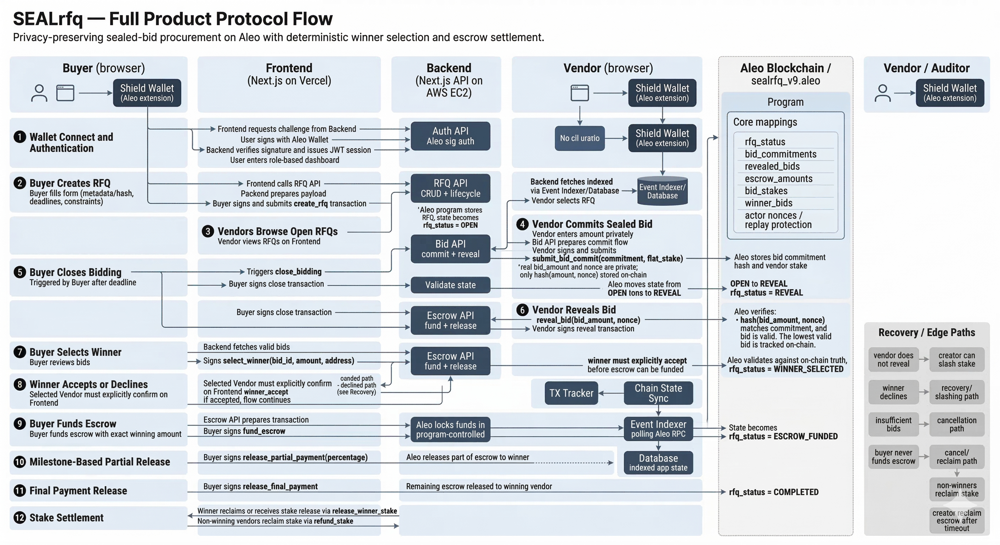
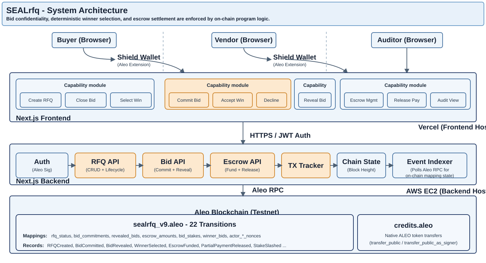

# SEALrfq
### Privacy-Preserving Sealed-Bid Procurement on Aleo

> **Sealed by mathematics. Not by a promise.**

[](https://aleo.org)
[](https://leo-lang.org)
[](https://github.com)

## What Is SEALrfq?

SEALrfq (Sealed Encrypted Auction Ledger for Requests for Quotation) is a trustless sealed-bid procurement protocol built on Aleo's zero-knowledge infrastructure.

It replaces the opaque, trust-dependent RFQ process used across enterprise procurement, government contracting, and B2B sourcing with a cryptographically enforced alternative — where **bid privacy**, **winner selection**, and **payment settlement** are guaranteed by on-chain program logic, not by platform operators.

## The Problem

Global procurement is a **$13 trillion market** with a structural trust problem.

Today's sealed-bid processes rely on centralized platforms or internal committees to keep bids confidential, select winners fairly, and settle payments honestly. In practice:

- **Bid leakage** — insiders preview bids and tip favored vendors
- **Bid shopping** — buyers use one vendor's price to pressure another
- **Rigged selection** — winner criteria applied retroactively to justify a predetermined choice
- **Payment disputes** — off-chain settlement creates delays, ambiguity, and zero auditability

These aren't edge cases. They are the default failure mode of trust-based procurement. Compliance layers treat symptoms — they don't remove the root cause. The issue is that the entire process depends on trusting an operator.

## Why Privacy Is the Foundation

Privacy is not a feature of SEALrfq. It is the foundational requirement.

Without it, sealed-bid procurement is a contradiction:

- If bids are visible, any participant with chain access can front-run, undercut, or collude — the "sealed" property is meaningless
- If stake amounts vary by bid size, observers can infer bid ranges from deposit amounts alone — privacy leaks through economics
- If winner selection logic is off-chain, there is no proof it was applied correctly — trust returns through the back door

**How SEALrfq solves this:**

- Bid amounts and nonces are private ZK inputs that never leave the proving circuit — the chain stores only a BHP256 commitment hash
- Stakes are **uniform flat amounts** derived from `min_bid` — identical for every bidder, leaking zero information
- Winner selection happens deterministically in `finalize` — verifiable by anyone, manipulable by no one
- Settlement flows through `credits.aleo` escrow with on-chain release conditions

Privacy here isn't about hiding from regulators. It's about removing the attack surface that makes procurement corrupt.

## How It Works

```
Commit → Bid → Reveal → Select → Award → Escrow → Deliver → Settle
```

| Phase | What Happens |
|-------|-------------|
| **Commit** | Buyer creates RFQ with terms, deadline, and min bid |
| **Bid** | Vendors submit BHP256 hash commitments + uniform stake |
| **Reveal** | Vendors reveal bid amount + nonce; circuit verifies hash match |
| **Select** | `finalize` deterministically selects lowest valid bid |
| **Award** | Winner explicitly accepts; buyer funds escrow |
| **Settle** | On delivery confirmation, escrow releases to winner; stakes refunded |



## Safety & Recovery

Every edge case has an on-chain escape path — no stuck states, no operator intervention required.

| Scenario | Resolution | Who Can Call |
|----------|-----------|-------------|
| Vendor doesn't reveal | Creator slashes stake within window | Creator (`slash_non_revealer`) |
| Vendor misses slash window | Vendor reclaims stake, no penalty | Vendor (`reclaim_unrevealed_stake`) |
| Winner declines award | Stake slashed to creator, others refunded | Winner (`winner_decline`) |
| Not enough bids | RFQ auto-cancelled after bidding deadline | Permissionless |
| No bids revealed + slash expired | RFQ cancelled (stuck state escape hatch) | Permissionless |
| Creator never funds escrow | RFQ cancelled after timeout, vendors refunded | Permissionless |
| Delivery never completes | Creator reclaims escrow; all vendors reclaim stakes | Creator |

## Security Properties

| Property | How It's Enforced |
|---------|-----------------|
| **Bid privacy** | `bid_amount` + `nonce` never leave the ZK circuit during commit |
| **No bid-switching** | Reveal must hash-match the original commitment (BHP256) |
| **Min-bid compliance** | Split ZK proof: circuit proves `bid >= claimed_min`, finalize verifies `claimed_min == actual` |
| **Uniform stakes** | Flat stake derived from `min_bid` — identical for all bidders, zero information leakage |
| **Replay protection** | Strictly sequential per-actor per-action nonces |
| **Re-entrancy safety** | Checks-effects-interactions: stakes zeroed before `credits.aleo` transfer |
| **No forced commitments** | Winner must explicitly accept before buyer can fund escrow |
| **No stuck states** | Every edge case has an escape transition |

## Why Aleo

SEALrfq is architecturally possible only on Aleo:

- **Private inputs** — bid amounts and nonces are ZK inputs; the chain stores only commitment hashes, never raw data
- **Record model** — supports private ownership semantics for event notifications
- **Leo async model** — cleanly separates ZK proofs (`transition`) from on-chain state validation (`finalize`)
- **Native settlement** — `credits.aleo` handles stakes and escrow without external bridges or oracle dependencies

Platforms like SAP Ariba, Coupa, and Jaggaer digitize procurement workflows — but they cannot prove they didn't look at your bids. Every "sealed" bid on these platforms is sealed by a promise. SEALrfq replaces that promise with a ZK proof.



## Market Opportunity

| Vertical | Market Size | Why They Need SEALrfq |
|---------|-----------|----------------------|
| Government & defense | $2T+ annually (US) | Bid-rigging prosecutions cost agencies billions. Mathematically verifiable fairness replaces compliance theater |
| Construction & infrastructure | $1.3T (US) | General contractors routinely "shop" subcontractor bids across rounds. A single sealed round with irreversible commitments eliminates this |
| Pharma & medical devices | $600B (global) | Hospital procurement committees face insider trading of bid information. ZK commitments remove the information asymmetry |
| Energy & utilities | $400B+ (global) | Long-term supply contracts where a 1% price leak costs millions |

**Immediate beachhead:** DAOs, protocol treasuries, and on-chain grant programs already allocate millions through governance processes where intent leaks before execution. SEALrfq gives them sealed bidding with native `credits.aleo` settlement — no bridges, no oracles, no trust assumptions beyond the chain itself.

## Market Analysis

Procurement corruption research from the [Governance and Social Development Resource Centre](https://gsdrc.org/document-library/corruption-in-public-procurement-causes-consequences-and-cures/) identifies three endemic fraud patterns:

| Corruption Type | How It Happens | SEALrfq Solution |
|---|---|---|
| **Bid leakage** | Officials share confidential bid information with preferred bidders | Bid amounts are private ZK inputs; chain stores only BHP256 hashes |
| **Bid shopping** | Procurement officials limit competitive bids and design specs to favor specific vendors | Uniform stakes + deterministic selection prevents favoritism; any vendor can bid anonymously |
| **Rigged selection** | "Quality degradation as goods are purchased from best briber, not best bid" | Winner selection happens deterministically in `finalize`; lowest valid bid always wins, verifiable by anyone |

These corruption patterns cost billions annually. The procurement market lacks cryptographic guarantees for fairness and privacy. Current platforms (SAP Ariba, Coupa, Jaggaer) can log transactions but cannot prove they didn't leak bids or manipulate winner selection. **SEALrfq replaces institutional trust with mathematical proof.**

## Roadmap

| Phase | Timeline | Milestone |
|-------|---------|----------|
| **Protocol** | Now | Complete working protocol on Aleo testnet. Open-source reference implementation |
| **DAO-first** | 6 months | First 10 live RFQs with real ALEO settlement across Aleo ecosystem DAOs and grant programs |
| **Vertical SaaS** | 12 months | Managed hosted portals for construction, government, and enterprise procurement. Fiat on-ramp. A procurement officer sees a dashboard, not a wallet |
| **Protocol licensing** | 18 months | SAP Ariba, Coupa, and Jaggaer have distribution but cannot build ZK privacy internally. SEALrfq becomes their privacy layer |

## Documentation

| Document | Contents |
|---------|---------|
| [`program.md`](documentation/program.md) | Leo contract design, all 22 transitions |
| [`backend.md`](documentation/backend.md) | API routes, indexer, transaction tracking |
| [`frontend.md`](documentation/frontend.md) | Wallet integration, UX patterns, page flows |

## The Bet

Privacy-preserving procurement is inevitable. Every sealed-bid process that relies on a trusted operator is a market waiting to be replaced. SEALrfq is the protocol building it first, building it right, and building it on the only chain where it is architecturally possible.

The moat is not a feature. It is the entire commit-reveal-select-settle pipeline — enforced by a Leo smart contract, verifiable by anyone, manipulable by no one. By the time a competitor rebuilds the ZK circuit, the stake economics, and the escrow settlement from scratch, SEALrfq has network effects, audit history, and ecosystem integrations they cannot replicate.

*Built on [Aleo](https://aleo.org) · Written in [Leo](https://leo-lang.org) · Trustless by design*
