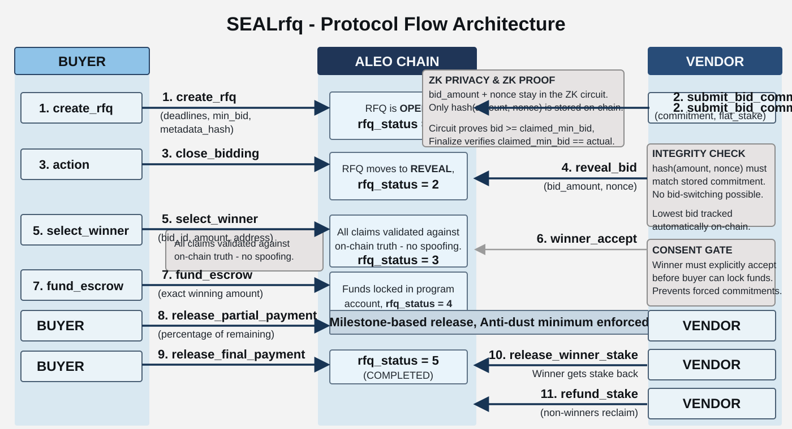

# SEALrfq — Privacy-Preserving Sealed-Bid Procurement on Aleo

SEALrfq is a sealed-bid procurement protocol built on Aleo. Bid confidentiality, deterministic winner selection, and escrow settlement are enforced by on-chain program logic — not by platform trust.


---

## Complete Protocol Flow



### Safety & Recovery Paths

```
 EDGE CASE                         WHAT HAPPENS                 WHO CAN CALL
 ─────────────────────────────────────────────────────────────────────────────
 Vendor doesn't reveal             Creator slashes stake        Creator only
                                   within SLASH_WINDOW          (slash_non_revealer)

 Vendor misses slash window        Vendor reclaims stake        Vendor
                                   (no penalty — window passed) (reclaim_unrevealed_stake)

 Winner declines award             Stake slashed to creator     Winner
                                   Other vendors refund         (winner_decline)

 Not enough bids                   RFQ auto-cancelled           Permissionless
                                   after bidding deadline       (cancel_rfq_insufficient_bids)

 No bids revealed + slash expired  RFQ cancelled                Permissionless
                                   (stuck state escape hatch)   (cancel_rfq_stuck_reveal)

 Creator never funds escrow        RFQ cancelled after timeout  Permissionless
                                   All vendors refund           (cancel_rfq_no_escrow)

 Delivery never completes          Creator reclaims escrow      Creator only
                                   after ESCROW_RECOVERY_BLOCKS (creator_reclaim_escrow)
                                   → STATUS_CANCELLED, all
                                   vendors reclaim stakes
```

---

## The Problem

Conventional procurement has a structural trust problem. Before bidding closes, bid access depends on internal permissions. In practice, that creates room for information leakage, preferential treatment, bid shopping, and disputes about winner selection fairness.

Settlement has a parallel problem — even after bidding, payment relies on off-chain coordination between buyers, vendors, and intermediaries, introducing delay, ambiguity, and inconsistent auditability.

**The issue is not a lack of software. The issue is that the process depends on trusting an operator.**

## Why Aleo

SEALrfq is built on Aleo because Aleo provides **privacy at the execution layer**:

- **Bid amounts and nonces are private ZK inputs** — the chain stores only the commitment hash, never the raw amount
- **The record model** supports private ownership semantics for event notifications
- **Leo's async transition + finalize model** cleanly separates ZK proofs (transition) from on-chain state validation (finalize)
- **`credits.aleo`** provides native settlement for stakes and escrow without external token bridges

## Key Security Properties

| Property | How It's Enforced |
|---|---|
| **Bid privacy** | `bid_amount` + `nonce` never leave the ZK circuit during commit |
| **No bid-switching** | Reveal must hash-match the original commitment (`BHP256`) |
| **Min-bid compliance** | Split ZK proof: circuit proves `bid >= claimed_min`, finalize verifies `claimed_min == actual` |
| **Uniform stakes** | Flat stake derived from `min_bid` — identical for all bidders, zero information leakage |
| **Replay protection** | Strictly sequential per-actor per-action nonces |
| **Re-entrancy safety** | Checks-effects-interactions: stakes zeroed before `credits.aleo` transfer |
| **No forced commitments** | Winner must explicitly accept before buyer can fund escrow |
| **Stake accountability** | Non-revealers slashed within time window; honest bidders always have a reclaim path |
| **No stuck states** | Every edge case (timeout, decline, insufficient bids, stuck reveal) has an escape transition |

## Repository Structure

```
SEALrfq/
├── contracts/
│   ├── v9/src/main.leo          # Demo contract (short time windows for testnet)
│   └── v10/src/main.leo         # Production contract (longer time windows)
├── backend/                     # Next.js API server (Render)
│   ├── api/                     # Route handlers (RFQ, Bid, Escrow, Auth)
│   ├── aleo/                    # Chain state, executor, fee estimation
│   ├── indexer/                 # Event listener + processor
│   ├── tx/                      # Transaction tracker + reconciliation
│   └── db/                      # Prisma schema + SQLite migrations
├── frontend/                    # Next.js app (Vercel)
│   ├── app/                     # Pages: buyer, vendor, escrow, audit flows
│   ├── components/              # Shared UI: ConfirmDialog, CopyButton, DeadlineCountdown
│   ├── contexts/                # WalletContext (Shield wallet integration)
│   └── lib/                     # walletTx, shieldWallet, authFetch
└── documentation/               # Detailed architecture docs
    ├── README.md
    ├── program.md               # Leo contract walkthrough
    ├── backend.md               # API + indexer + DB design
    └── frontend.md              # Frontend architecture
```

## Documentation

Detailed implementation docs are in [`documentation/`](./documentation):

- [`program.md`](./documentation/program.md) — Leo contract design, all 22 transitions
- [`backend.md`](./documentation/backend.md) — API routes, indexer, transaction tracking
- [`frontend.md`](./documentation/frontend.md) — Wallet integration, UX patterns, page flows
