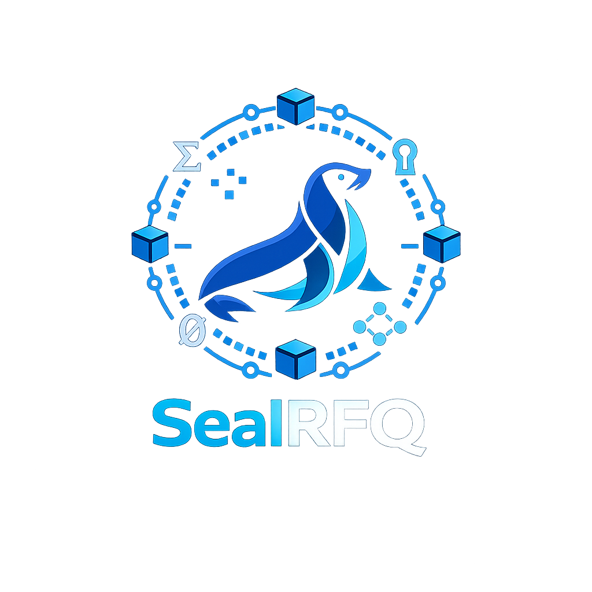
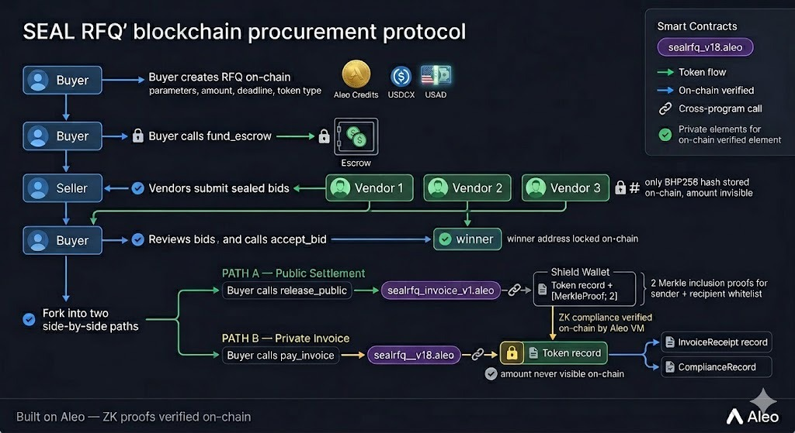
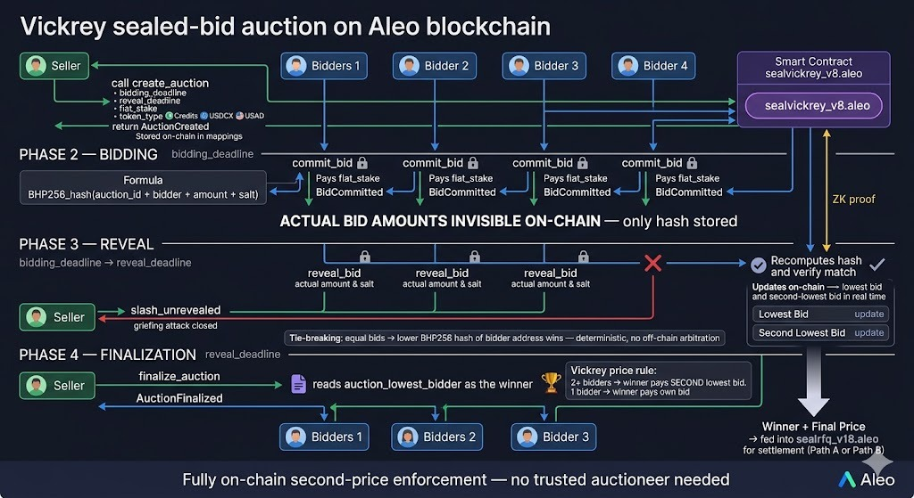
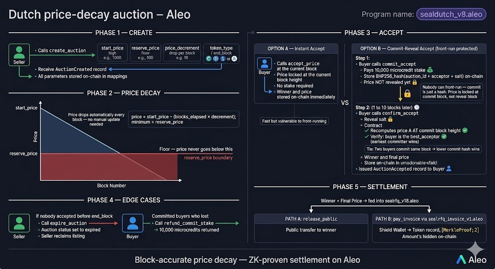

<div align="center">
  
  <h1>SEAL RFQ</h1>
  <p>Privacy-preserving procurement protocol on Aleo — sealed bids, private settlement, compliance-grade stablecoin payments</p>
  <br/>
  <a href="https://sealrfq-frontend.vercel.app"><strong>🌐 Live App</strong></a> &nbsp;·&nbsp;
  <a href="https://github.com/ayushsaklani-min/SEALrfq"><strong>GitHub</strong></a>
</div>

---

## What is SEAL RFQ

SEAL RFQ is a fully on-chain Request-for-Quote and auction settlement protocol built on Aleo. Buyers post procurement requests, vendors submit sealed bids, and the protocol handles winner selection and settlement — all with zero-knowledge guarantees. No bid amount is ever visible on-chain during the bidding phase. Settlement can happen publicly or completely privately using Aleo's native private record system.

Three settlement mechanisms are supported — Standard RFQ, Vickrey sealed-bid auction, and Dutch price-decay auction — and all three feed into the same settlement layer supporting Aleo Credits, USDCX, and USAD stablecoins.

---

## Programs

All four programs are written in **Leo 3.5.0** and deployed on **Aleo Testnet**.

| Program | Lines | Description |
|---|---|---|
| `sealrfq_v18.aleo` | 700+ | Core RFQ engine — escrow, bidding, winner selection, fee treasury, public and private settlement |
| `sealrfq_invoice_v1.aleo` | 160 | Private invoice payment — cross-program calls into Credits, USDCX, USAD in a single transition |
| `sealvickrey_v8.aleo` | 460 | Sealed-bid second-price Vickrey auction — commit, reveal, finalize, slash, 19 on-chain mappings |
| `sealdutch_v8.aleo` | 365 | Dutch price-decay auction — block-accurate price decay with commit-reveal front-run protection |

---

## Standard RFQ Flow



**Buyer** creates an RFQ on-chain with amount, deadline, and token type. Funds are locked into the smart contract escrow via `fund_escrow`. **Vendors** each submit a sealed bid — only the BHP256 hash is stored on-chain, the actual amount is never visible. Buyer reviews bids, calls `accept_bid`, and the winner address is locked on-chain.

Settlement forks into two paths:

**Path A — Public Settlement**
Buyer calls `release_public` and tokens flow directly from escrow to the winner publicly via `credits.aleo/transfer_public`.

**Path B — Private Invoice**
Buyer calls `pay_invoice` on `sealrfq_invoice_v1.aleo`. The Shield wallet provides a private Token record plus two MerkleProof compliance records. The Aleo VM validates both proofs on-chain — proving sender and recipient are whitelisted — and executes `transfer_private`. The winner receives funds via a private record. The amount is never visible on-chain. Two output records are generated: an `InvoiceReceipt` and a `ComplianceRecord`.

---

## Vickrey Sealed-Bid Auction



A true second-price sealed-bid auction. No one — including the seller — sees any bid amount until the reveal phase.

**Phase 1 — Create**
Seller calls `create_auction` with `bidding_deadline`, `reveal_deadline`, `flat_stake`, and `token_type`. All params stored on-chain in mappings. Seller receives an `AuctionCreated` record.

**Phase 2 — Bidding**
Each bidder calls `commit_bid` and submits `BHP256_hash(auction_id + bidder + amount + salt)`. The actual amount is invisible on-chain. Each bidder pays a flat stake to the contract and receives a `BidCommitted` record. One bid per vendor enforced on-chain.

**Phase 3 — Reveal**
After `bidding_deadline`, bidders call `reveal_bid` with their actual amount and salt. The contract recomputes the hash and verifies it matches. On-chain bid ranking updates in real time — tracking lowest bid and second-lowest bid. Bidders who committed but never reveal have their stake slashed by the seller via `slash_unrevealed`. This closes the griefing attack vector entirely.

Tie-breaking is deterministic — equal bids are resolved by comparing `BHP256_hash(bidder_address)`. Lower hash wins. No off-chain arbitration needed.

**Phase 4 — Finalization**
Seller calls `finalize_auction` after `reveal_deadline`. Contract reads `auction_lowest_bidder` as winner. Final price is the second-lowest revealed bid if 2+ bidders revealed, otherwise the winner's own bid. Seller receives `AuctionFinalized` record. Losing bidders call `refund_stake` to reclaim their deposits.

Winner and final price feed into `sealrfq_v18.aleo` for Path A or Path B settlement.

---

## Dutch Price-Decay Auction



A Dutch auction where price starts high and decreases by a fixed `price_decrement` every block until it hits the `reserve_price` floor. Price decay is computed entirely on-chain — no manual updates needed.

**Phase 1 — Create**
Seller sets `start_price`, `reserve_price`, `price_decrement`, `start_block`, `end_block`, and `token_type`. All stored on-chain. Seller receives `AuctionCreated` record.

**Phase 2 — Price Decay**
Price drops automatically every block:
```
price = start_price − (blocks_elapsed × price_decrement)
minimum = reserve_price
```
Floor handling is exact — both evenly-divisible and remainder cases handled correctly so price never goes below `reserve_price`.

**Phase 3 — Accept**

*Option A — Instant Accept*
Buyer calls `accept_price` at the current block. Price locked immediately. No stake required. Fast but vulnerable to front-running.

*Option B — Commit-Reveal Accept (front-run protected)*
Buyer calls `commit_accept` and stores `BHP256_hash(auction_id + acceptor + salt)` on-chain. Pays a 10,000 microcredit stake. The price is NOT revealed — it is locked at the commit block height. Nobody can front-run because the commit is just a hash.

1–10 blocks later, buyer calls `confirm_accept`, reveals the salt, and the contract recomputes the price at the original commit block height — not the reveal block. It verifies the buyer is the `best_acceptor` (earliest committer wins, ties broken by lower commit hash). Winner and final price stored on-chain. Buyer receives `AuctionAccepted` record.

**Phase 4 — Edge Cases**
If nobody accepts before `end_block`, seller calls `expire_auction`. Committed buyers who lost call `refund_commit_stake` to recover their 10,000 microcredits.

Winner and price feed into `sealrfq_v18.aleo` for Path A or Path B settlement.

---

## Multi-Token Support

Every RFQ and auction carries a `token_type` field from creation through settlement:

| Value | Token | Program | Settlement |
|---|---|---|---|
| `0` | Aleo Credits | `credits.aleo` | `transfer_public` or `transfer_private` |
| `1` | USDCX | `test_usdcx_stablecoin.aleo` | `transfer_private` + `[MerkleProof; 2]` |
| `2` | USAD | `test_usad_stablecoin.aleo` | `transfer_private` + `[MerkleProof; 2]` |

USDCX and USAD are Aleo's deployed compliance stablecoin programs. Their `transfer_private` function requires two `MerkleProof` structs — Merkle inclusion proofs proving both the sender and recipient are on the Shield compliance whitelist:

```
struct MerkleProof:
    siblings as [field; 16u32]
    leaf_index as u32
```

The Shield wallet provides these proofs automatically alongside the Token record. The Aleo VM validates them on-chain. `token_type` is always read back from on-chain mappings at settlement — never trusted from the frontend.

---

## Admin Dashboard

Platform admins can configure the protocol via the built-in admin dashboard:

- Set fee basis points via `configure_platform`
- Pause new RFQ creation
- Withdraw accumulated Credits fees via `withdraw_fees`
- Withdraw accumulated USDCX fees via `withdraw_fees_usdcx`
- View live treasury balances read directly from on-chain mappings

---

## Deployment

| Layer | Stack |
|---|---|
| Frontend | Next.js 14 on Vercel |
| Backend | Next.js API on AWS EC2 ap-southeast-2, nginx reverse proxy |
| Database | Prisma + SQLite |
| Wallet | Shield Wallet by Provable HQ |
| Network | Aleo Testnet |

**Live**: https://sealrfq-frontend.vercel.app
**GitHub**: https://github.com/ayushsaklani-min/SEALrfq

---
